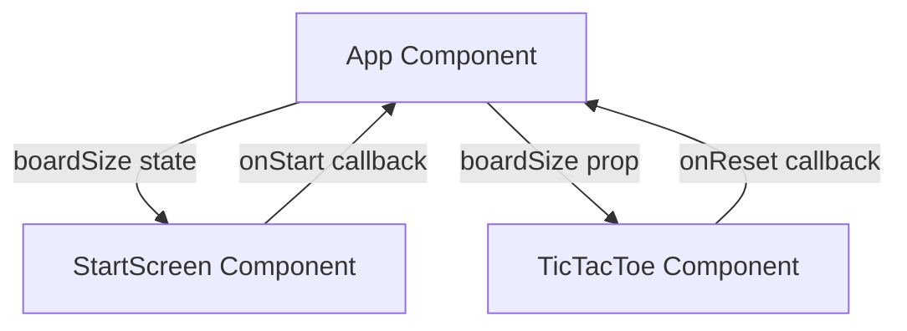
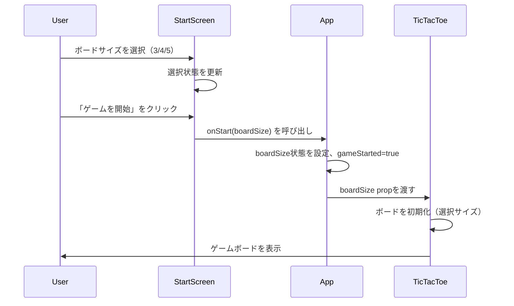

# Design Document

---
**Purpose**: Provide sufficient detail to ensure implementation consistency across different implementers, preventing interpretation drift.

**Approach**:
- Include essential sections that directly inform implementation decisions
- Omit optional sections unless critical to preventing implementation errors
- Match detail level to feature complexity
- Use diagrams and tables over lengthy prose

**Warning**: Approaching 1000 lines indicates excessive feature complexity that may require design simplification.
---

> Sections may be reordered (e.g., surfacing Requirements Traceability earlier or moving Data Models nearer Architecture) when it improves clarity. Within each section, keep the flow **Summary → Scope → Decisions → Impacts/Risks** so reviewers can scan consistently.

## Overview

本機能は、既存の3×3三目並べゲームを拡張し、プレイヤーがボードサイズ（3×3、4×4、5×5）を選択できるようにする。スタート画面でサイズを選択し、選択されたサイズに応じたボードと勝敗判定を提供する。

**Users**: ゲームプレイヤーが異なる難易度やゲーム時間で三目並べを楽しむために使用する。

**Impact**: 既存の固定3×3ボードから可変サイズボードへの拡張により、より多様なゲーム体験を提供する。既存のコンポーネント構造（StartScreen、TicTacToe）を拡張する形で実装し、後方互換性を維持する。

### Goals
- プレイヤーがゲーム開始前にボードサイズを選択できる
- 選択されたサイズに応じた適切なボード表示と勝敗判定を提供する
- 既存のUI/UXパターンと一貫性を維持する
- 型安全な実装により、バグの発生を抑制する

### Non-Goals
- ボードサイズの動的変更（ゲーム中でのサイズ変更は対象外）
- 6×6以上のサイズ対応（将来的な拡張の可能性は残すが、現時点では対象外）
- ボードサイズの保存・読み込み機能（ローカルストレージ等への永続化は対象外）
- AI対戦機能やオンライン対戦機能（単一機能に焦点を当てる）

## Architecture

> Reference detailed discovery notes in `research.md` only for background; keep design.md self-contained for reviewers by capturing all decisions and contracts here.
> Capture key decisions in text and let diagrams carry structural detail—avoid repeating the same information in prose.

### Existing Architecture Analysis

既存システムは以下の構造を持つ：

- **Appコンポーネント**: アプリケーションのルートコンポーネント。`gameStarted`状態を管理し、StartScreenとTicTacToeを切り替える。
- **StartScreenコンポーネント**: スタート画面を表示。`onStart`コールバックを受け取り、ゲーム開始を通知する。
- **TicTacToeコンポーネント**: ゲームボードとロジックを管理。`onReset`コールバックを受け取り、スタート画面への戻りを通知する。内部でボード状態、現在のプレイヤー、勝敗状態を管理する。

**既存パターンの維持**:
- コンポーネント単位のCSS分離パターン
- Props経由の親子間通信
- 関数コンポーネントとHooksによる状態管理
- TypeScript strict modeによる型安全性

### Architecture Pattern & Boundary Map



**Architecture Integration**:
- **Selected pattern**: Props経由の状態管理パターン（既存パターンの拡張）
- **Domain/feature boundaries**: 
  - Appコンポーネント: アプリケーション全体の状態管理（ゲーム開始状態、ボードサイズ）
  - StartScreenコンポーネント: スタート画面の表示とボードサイズ選択UI
  - TicTacToeコンポーネント: ゲームロジックとボード表示
- **Existing patterns preserved**: 
  - コンポーネント単位のCSS分離
  - Props経由の親子間通信
  - Hooksによる状態管理
- **New components rationale**: 新規コンポーネントは追加せず、既存コンポーネントを拡張する形で実装
- **Steering compliance**: 
  - TypeScript strict modeによる型安全性の維持
  - 関数コンポーネントとHooksパターンの維持
  - コンポーネント単位のCSS分離パターンの維持

### Technology Stack

| Layer | Choice / Version | Role in Feature | Notes |
|-------|------------------|-----------------|-------|
| Frontend | React 18.2 | UIコンポーネントの実装 | 既存スタック |
| Language | TypeScript 5.3+ | 型安全な実装 | 既存スタック、`BoardSize`型を追加 |
| Build Tool | Vite 5.0+ | 開発サーバーとビルド | 既存スタック |
| Runtime | ブラウザ（ES Modules） | 実行環境 | 既存スタック |

新規依存関係は不要。既存の技術スタックを活用する。

## System Flows

### ボードサイズ選択からゲーム開始までのフロー



**Key Decisions**:
- ボードサイズはStartScreenで選択され、Appコンポーネントを経由してTicTacToeに渡される
- ゲーム開始時にボードサイズが確定し、ゲーム中は変更されない
- リセット時は現在のボードサイズを維持し、スタート画面に戻る際はリセットされる

## Requirements Traceability

| Requirement | Summary | Components | Interfaces | Flows |
|-------------|---------|------------|------------|-------|
| 1.1 | スタート画面でボードサイズ選択オプションを表示 | StartScreen | StartScreenProps | System Flow |
| 1.2 | ボードサイズ選択を記録 | StartScreen, App | StartScreenProps, App state | System Flow |
| 1.3 | 選択されたサイズでゲーム開始 | App, TicTacToe | TicTacToeProps | System Flow |
| 1.4 | デフォルト3×3サイズ | App | App state initialization | - |
| 1.5 | 選択サイズの視覚的表示 | StartScreen | StartScreen UI | - |
| 2.1 | 選択サイズのボード表示 | TicTacToe | TicTacToe rendering | - |
| 2.2 | 空の状態でボード初期化 | TicTacToe | initializeBoard function | - |
| 2.3 | サイズに応じたレイアウト調整 | TicTacToe | TicTacToe CSS | - |
| 2.4 | 4×4/5×5でのマスサイズ調整 | TicTacToe | TicTacToe CSS | - |
| 3.1 | サイズに応じた勝敗判定 | TicTacToe | checkWinner function | - |
| 3.2 | 3×3での3目並び判定 | TicTacToe | checkWinner function | - |
| 3.3 | 4×4での4目並び判定 | TicTacToe | checkWinner function | - |
| 3.4 | 5×5での5目並び判定 | TicTacToe | checkWinner function | - |
| 3.5 | 勝利時の表示とゲーム終了 | TicTacToe | TicTacToe state | - |
| 3.6 | 引き分け判定 | TicTacToe | isBoardFull function | - |
| 4.1 | リセット時のサイズ維持 | TicTacToe | handleReset function | - |
| 4.2 | スタート画面戻り時のリセット | App | App state management | System Flow |
| 4.3 | サイズに応じた状態管理 | TicTacToe | TicTacToe state | - |
| 4.4 | 既存機能への影響なし | All | Component interfaces | - |
| 5.1 | 既存デザインパターンに従う | All | CSS structure | - |
| 5.2 | 既存コンポーネント構造との互換性 | All | Component structure | - |
| 5.3 | CSS命名規則の維持 | All | CSS classes | - |

## Components and Interfaces

### Component Summary

| Component | Domain/Layer | Intent | Req Coverage | Key Dependencies (P0/P1) | Contracts |
|-----------|--------------|--------|--------------|--------------------------|-----------|
| App | Application Root | アプリケーション全体の状態管理と画面切り替え | 1.2, 1.3, 1.4, 4.2 | StartScreen (P0), TicTacToe (P0) | State |
| StartScreen | UI | スタート画面の表示とボードサイズ選択 | 1.1, 1.2, 1.5 | App (P0) | State |
| TicTacToe | UI/Logic | ゲームボードの表示とゲームロジック | 2.1-2.4, 3.1-3.6, 4.1, 4.3 | App (P0) | State |

### UI Layer

#### App Component

| Field | Detail |
|-------|--------|
| Intent | アプリケーション全体の状態管理と画面切り替えを担当 |
| Requirements | 1.2, 1.3, 1.4, 4.2 |

**Responsibilities & Constraints**
- `gameStarted`状態と`boardSize`状態を管理する
- StartScreenとTicTacToeの切り替えを制御する
- ボードサイズをStartScreenから受け取り、TicTacToeに渡す
- スタート画面に戻る際は`boardSize`をリセットする

**Dependencies**
- Inbound: StartScreen — ゲーム開始とボードサイズ選択の通知 (P0)
- Inbound: TicTacToe — スタート画面への戻り通知 (P0)
- Outbound: StartScreen — `onStart`コールバックの提供 (P0)
- Outbound: TicTacToe — `boardSize` propと`onReset`コールバックの提供 (P0)

**Contracts**: State [✓]

##### State Management
- **State model**: 
  - `gameStarted: boolean` — ゲーム開始状態
  - `boardSize: BoardSize` — 選択されたボードサイズ（3, 4, 5）
- **Persistence & consistency**: 
  - 状態はコンポーネント内で管理され、ページリロード時にリセットされる
  - ボードサイズはゲーム開始時に確定し、ゲーム中は変更されない
- **Concurrency strategy**: 
  - 単一ユーザーのシングルスレッド環境のため、競合状態は発生しない

**Implementation Notes**
- **Integration**: `useState`フックを使用して状態を管理。`onStart`コールバックで`boardSize`と`gameStarted`を更新。
- **Validation**: `boardSize`は`BoardSize`型により型安全に管理される。デフォルト値は`3`。
- **Risks**: 状態管理の複雑度が若干増加するが、既存パターンと一致しているため許容範囲内。

#### StartScreen Component

| Field | Detail |
|-------|--------|
| Intent | スタート画面の表示とボードサイズ選択UIを提供 |
| Requirements | 1.1, 1.2, 1.5 |

**Responsibilities & Constraints**
- ボードサイズ選択UI（3×3、4×4、5×5）を表示する
- 選択されたサイズを視覚的に強調表示する
- 「ゲームを開始」ボタンで選択されたサイズを親コンポーネントに通知する
- サイズが選択されていない場合はデフォルトで3×3を選択状態とする

**Dependencies**
- Inbound: App — `onStart`コールバックの提供 (P0)
- Outbound: App — 選択されたボードサイズの通知 (P0)

**Contracts**: State [✓]

##### State Management
- **State model**: 
  - `selectedSize: BoardSize` — 選択されたボードサイズ（内部状態、デフォルト: `3`）
- **Persistence & consistency**: 
  - コンポーネント内で管理され、マウント時にデフォルト値で初期化される
- **Concurrency strategy**: 
  - 単一ユーザーのシングルスレッド環境のため、競合状態は発生しない

**Implementation Notes**
- **Integration**: ラジオボタンまたはボタングループでサイズ選択UIを実装。選択状態を`useState`で管理。
- **Validation**: `selectedSize`は`BoardSize`型により型安全に管理される。
- **Risks**: UIの実装が既存のデザインパターンと一貫性を保つ必要がある。

#### TicTacToe Component

| Field | Detail |
|-------|--------|
| Intent | ゲームボードの表示とゲームロジック（勝敗判定、状態管理）を担当 |
| Requirements | 2.1-2.4, 3.1-3.6, 4.1, 4.3 |

**Responsibilities & Constraints**
- `boardSize` propを受け取り、対応するサイズのボードを表示する
- ボードサイズに応じた勝敗判定ロジックを実装する
- ゲーム状態（ボード配列、現在のプレイヤー、勝敗状態）を管理する
- リセット時は現在の`boardSize`を維持してボードを初期化する

**Dependencies**
- Inbound: App — `boardSize` propと`onReset`コールバックの提供 (P0)
- Outbound: App — スタート画面への戻り通知 (P0)

**Contracts**: State [✓]

##### State Management
- **State model**: 
  - `board: Player[][]` — ゲームボードの状態（動的にサイズが決定される）
  - `currentPlayer: Player` — 現在のプレイヤー（'X' または 'O'）
  - `winner: Player | null` — 勝利したプレイヤー（nullの場合は未決着）
  - `isDraw: boolean` — 引き分け状態
- **Persistence & consistency**: 
  - 状態はコンポーネント内で管理され、`boardSize` propの変更時に再初期化される
  - ボード配列のサイズは`boardSize` propと一致する必要がある
- **Concurrency strategy**: 
  - 単一ユーザーのシングルスレッド環境のため、競合状態は発生しない

**Implementation Notes**
- **Integration**: `useEffect`フックを使用して`boardSize` propの変更を検知し、ボードを再初期化する。`checkWinner`関数を可変サイズ対応に変更。
- **Validation**: ボード配列のサイズと`boardSize` propの整合性を実装時に保証する。勝敗判定ロジックの正確性をテストで検証する。
- **Risks**: 
  - 勝敗判定ロジックのバグにより、不正な勝利判定が発生する可能性がある。包括的なテストケースで対策する。
  - 4×4、5×5ボードでのCSSレイアウトが画面サイズによっては表示しきれない可能性がある。レスポンシブデザインで対策する。

## Data Models

### Domain Model

**Entities**:
- **BoardSize**: ボードサイズを表す値オブジェクト（3, 4, 5のいずれか）
- **Player**: プレイヤーを表す値オブジェクト（'X', 'O', nullのいずれか）
- **Board**: ゲームボードを表すエンティティ（`Player[][]`型の2次元配列）

**Value Objects**:
- `BoardSize = 3 | 4 | 5` — ボードサイズの型定義
- `Player = 'X' | 'O' | null` — プレイヤーの型定義

**Business Rules & Invariants**:
- ボード配列のサイズは`boardSize`と一致する必要がある
- 勝利条件はボードサイズに応じて決定される（3×3→3目、4×4→4目、5×5→5目）
- ゲーム中にボードサイズは変更されない（不変性）

### Logical Data Model

**Structure Definition**:
- **Board Array**: `Player[][]`型の2次元配列
  - 行数・列数: `boardSize`に等しい
  - 各要素: `Player`型（'X', 'O', nullのいずれか）
- **BoardSize**: 数値リテラル型 `3 | 4 | 5`
- **Game State**: 
  - `board: Player[][]` — ボード状態
  - `currentPlayer: Player` — 現在のプレイヤー
  - `winner: Player | null` — 勝利プレイヤー
  - `isDraw: boolean` — 引き分け状態

**Consistency & Integrity**:
- ボード配列のサイズは`boardSize`と常に一致する（実行時バリデーションで保証）
- ゲーム状態の整合性: `winner`がnullでない場合、`isDraw`はfalseである
- トランザクション境界: 1つのマスへの着手は不可分操作として実装される

### Data Contracts & Integration

**Component Props Contracts**:

**StartScreenProps**:
```typescript
interface StartScreenProps {
  onStart: (boardSize: BoardSize) => void;
}
```

**TicTacToeProps**:
```typescript
interface TicTacToeProps {
  boardSize: BoardSize;
  onReset: () => void;
}
```

**Type Definitions**:
```typescript
type BoardSize = 3 | 4 | 5;
type Player = 'X' | 'O' | null;
type Board = Player[][];
```

**Validation Rules**:
- `boardSize`は`BoardSize`型により型安全に管理される
- ボード配列の生成時、サイズの整合性を保証する

## Error Handling

### Error Strategy

既存のエラーハンドリングパターンを維持する。可変サイズ対応により追加されるエラーシナリオは以下の通り：

- **Invalid Board Size**: `boardSize` propが`BoardSize`型の範囲外の場合（型システムにより防止されるが、実行時バリデーションも実施）
- **Board Size Mismatch**: ボード配列のサイズが`boardSize` propと一致しない場合（実装時のバグとして検出）

### Error Categories and Responses

**User Errors** (4xx): 該当なし（クライアントサイドのみの実装のため）

**System Errors** (5xx): 該当なし（クライアントサイドのみの実装のため）

**Business Logic Errors**:
- **Invalid Move**: 既に埋まっているマスへの着手 → 既存の実装で無視される（変更なし）
- **Game Already Finished**: ゲーム終了後の着手 → 既存の実装で無視される（変更なし）

### Monitoring

エラートラッキングやロギングは現時点では対象外（クライアントサイドのみの実装のため）。実装時のデバッグはブラウザの開発者ツールを使用する。

## Testing Strategy

### Unit Tests
- `checkWinner`関数のテスト（各サイズ3, 4, 5での横・縦・斜めの勝利パターン）
- `isBoardFull`関数のテスト（各サイズでの引き分け判定）
- ボード初期化関数のテスト（各サイズでの正しい配列生成）

### Integration Tests
- AppコンポーネントからStartScreen、TicTacToeへの状態受け渡しのテスト
- ボードサイズ選択からゲーム開始までのフローのテスト
- リセット機能のテスト（ボードサイズの維持）

### E2E/UI Tests
- スタート画面でのボードサイズ選択UIのテスト
- 各サイズでのゲームプレイフローのテスト
- リセットとスタート画面への戻りのテスト

### Performance/Load
- 5×5ボードでのレンダリングパフォーマンス（25マスの描画）
- 勝敗判定ロジックのパフォーマンス（大規模ボードでの計算時間）

## Optional Sections

### Security Considerations

本機能はクライアントサイドのみの実装であり、認証や機密データの扱いはない。セキュリティ上の考慮事項は既存の実装と同様。

### Performance & Scalability

**Target Metrics**:
- ボードサイズ選択UIの応答性: 100ms以下
- 勝敗判定の実行時間: 5×5ボードで10ms以下
- ボードレンダリング: 5×5ボードで60fps維持

**Scaling Approaches**:
- 現時点ではクライアントサイドのみの実装のため、スケーリングの考慮は不要
- 将来的にサーバーサイド実装を追加する場合、ボードサイズに応じた計算リソースの最適化を検討

**Caching Strategies**:
- ボード配列の生成結果をメモ化することで、再レンダリング時のパフォーマンスを向上させる可能性がある（実装時に検討）
